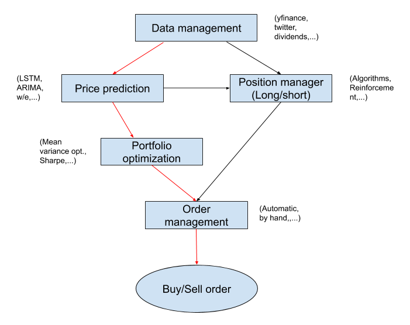
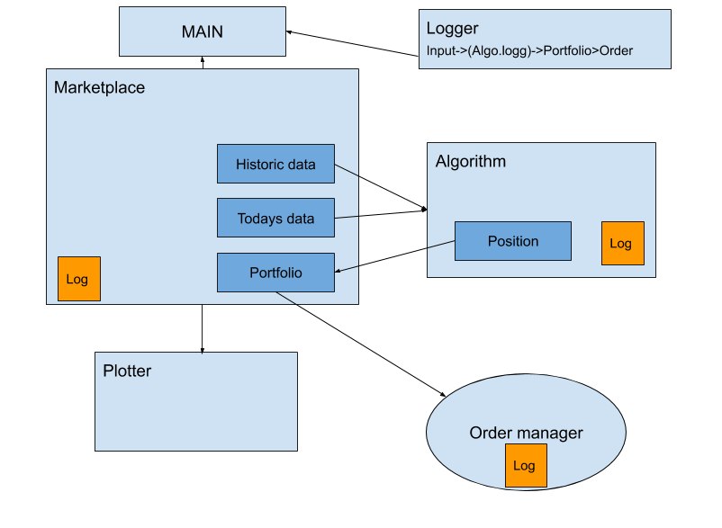

# Kompisfonden

Den mest extrema hedgefonden

```
https://github.com/ranaroussi/yfinance
```

Tickers:
 ```
 investexcel.net
 ```


 To make pyportfolioopt install if we use python 3.8 for example
 ```bash
sudo apt install python3.8-dev
sudo apt install libpython3.8-dev
 ```

------------------------------------------------------------------------
Work in progress - Jonte

**Workflow**



Data management
- [x] Download ticker data

Price prediction
- [x] Simple LSTM

Position manager
- [ ] Working long/short position 

Portfolio optimization
- [x] Efficient frontier

Order management
- [ ] Create/test a account

**Structure**



Main
- Contains the "runnable" script.
- Should initialize a marketplace & a logger.
- Should be able to take action from user (Backtesting, print logg, etc.).

Logger
- Should format information from the different parts.
- Maybe do some analasys (Where did it go wrong, anomalies, etc.).

Marketplace
- Should get info and send to Algorithms (Historic data, helper function, etc.).
- Should be able to run backtesting from a given algorithms.
- Should be able to communicate with Plotter.
- Should, if allowed, send buy/sell action to Order manager.

Algorithm
- Should construct a position from data given (time, ticker, data) and send to Portfolio.
- Maybe should be inherited from an abstract class. 

Order manager
- Should get buy/sell order, either print them or automatic place an order through and api.
